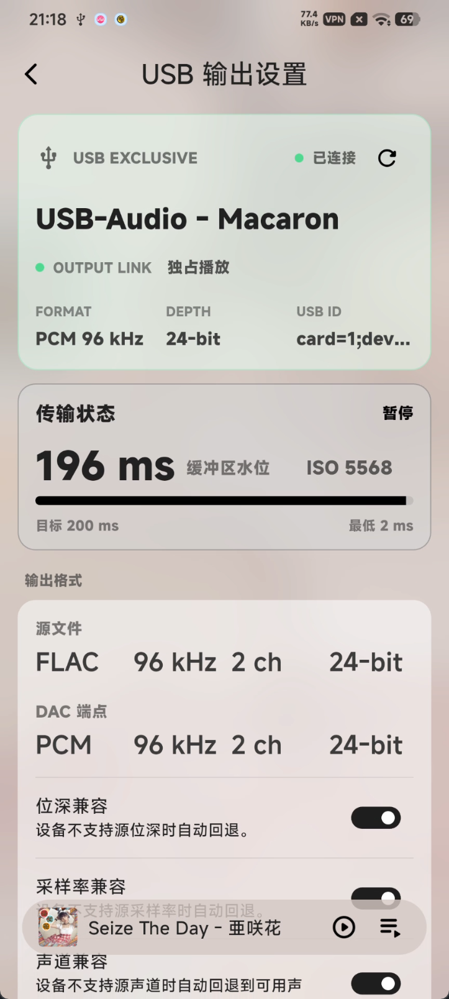
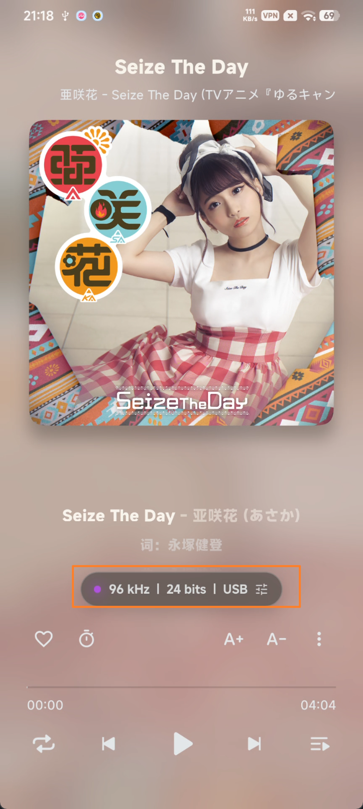
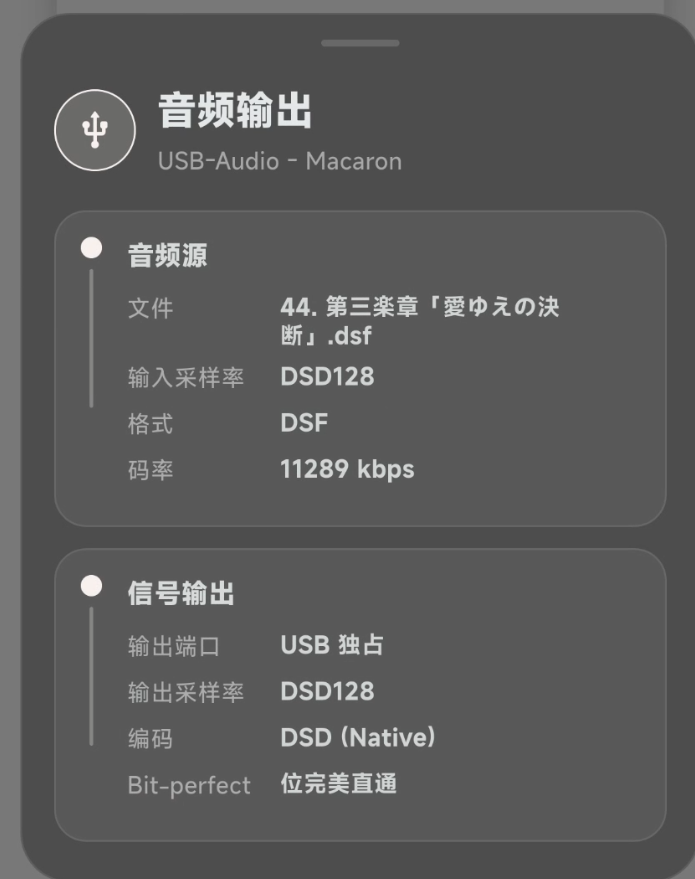
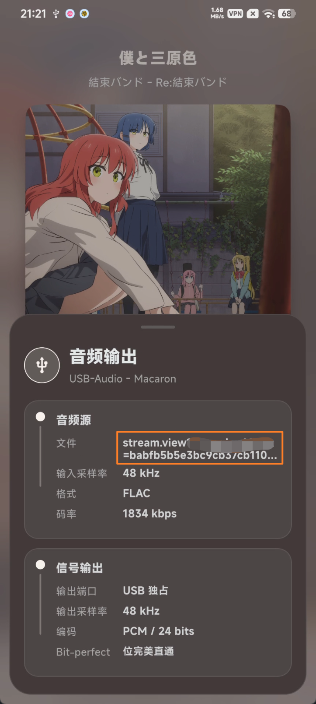
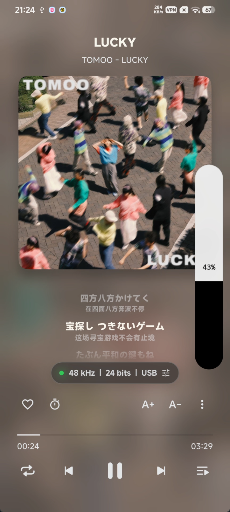
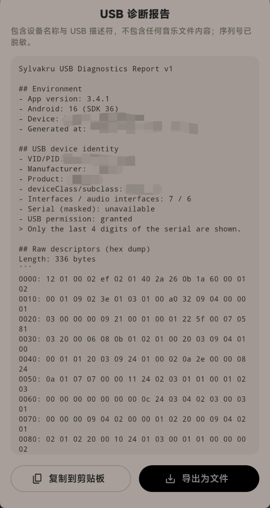

# USB 独占播放功能介绍

本分支在原版基础上，新增了一整套 **USB 独占直驱播放** 能力：绕开安卓混音器，把音频以位完美（bit-perfect）方式直接推给外接 USB DAC，并围绕它补齐了 DSD、云端流式、独占音量、状态显示与 DAC 适配诊断等配套功能。

> 说明：独占播放需要外接支持 UAC 的 USB DAC；未接 DAC 时自动走系统共享输出，功能与原版一致。

---

## 功能总览

| 功能              | 一句话说明                                          |
| ----------------- | --------------------------------------------------- |
| USB 独占直驱      | 位完美直推 DAC，采样率跟随音源并校验 DAC 时钟       |
| 状态胶囊          | 播放页实时显示 采样率 / 位深 / 输出通道，一键进设置 |
| DSD 播放          | 支持 DoP / Native / 转 PCM 三种输出策略             |
| 固定采样率 / 位深 | 可锁定输出格式，适配挑剔的 DAC                      |
| 云端歌曲流式独占  | 边下边独占直驱，不断流、不爆音                      |
| 独占音量控制      | 数字音量 + 物理音量键接管 + 悬浮音量条              |
| 格式扩展          | 独占支持系统可解码的有损格式（m4a/mp3/ogg 等）      |
| DAC 适配          | quirk 体系 + 一键诊断报告，方便适配与反馈           |

---

## 1. USB 独占直驱播放

开启独占后，App 直接接管 USB DAC，音频以原始采样率、位深位完美送出，不经过安卓系统重采样与混音。输出采样率自动跟随当前曲目，并会校验 DAC 的实际时钟；若 DAC 不支持该采样率或时钟不匹配，会自动回退到系统共享输出，避免出现杂音或无声。

## 2. 状态胶囊与音频输出设置入口

播放页底部新增一个 **状态胶囊**，实时显示当前的 `采样率 | 位深 | 输出通道`（如 `96 kHz | 24 bits | USB`）：

- 左侧圆点用颜色表示独占链路的实时状态；
- 点击右侧图标可直接进入「音频输出设置」页；
- 拔出 DAC 时会自动回退并更新显示。

---

## 3. DSD 播放（DoP / Native / 转 PCM）

支持 `.dsf` / `.dff` 的 DSD 文件进库、识别与播放，并提供三种输出策略：

- **PCM**：由解码器转为 PCM，走系统输出，兼容性最好；
- **DoP**：以 PCM 帧封装 DSD，设备支持时使用；
- **Native**：设备声明 RAW_DATA 或 quirk 指定字节排列时直发 DSD，否则自动回退 DoP。

## 4. 云端歌曲流式独占

云端歌曲无需等待整曲下载完成即可进入独占直驱：**边下载边独占播放**，并会预取队列中的下一首。做了流式优先与缓存并发保护，切歌 / seek 到未下载区不会误判结束而跳歌，也不会掉出独占产生断流。

---

## 5. 独占音量控制

独占模式下系统音量条被接管，改由 App 内部控制：

- **数字音量**：在独占链路上施加数字增益，感知音量曲线与共享输出一致；
- **物理音量键接管**：按手机音量键会弹出右侧竖向 **悬浮音量条**，可点击 / 拖动调节，静止约 2 秒自动隐藏；
- 提供多种音量控制方式（自动 / DAC 硬件音量 / 数字音量 / 原始数字电平旁路），以及 DSD 增益补偿、媒体音量、平滑接管等选项。

> 注意：选择「原始数字电平旁路（位完美）」时，数字音量按设计被禁用，此时拖动音量条不会改变输出电平，属正常现象。DSD 独占为 1-bit 码流，同样无法软件调音量。

## 6. DAC 适配 quirk 与诊断报告

- **quirk 体系**：内置常见 DAC 的适配配置，并支持本地 `override` 导入，针对个别设备做字节排列 / 时钟等微调；
- **一键诊断报告**：可复制 / 导出当前 DAC 的适配诊断信息（端点、格式描述符、时钟源、quirk 命中情况等），便于排查与反馈。

---

## 遇到问题 / 反馈

如果你在使用 USB 独占时遇到问题（无声、杂音、无法进入独占、DSD 不识别等），欢迎反馈帮助适配：

1. 在「音频输出设置」页底部 **生成诊断报告** 并复制 / 导出；
2. 尽量附上 DAC 型号、出问题的曲目格式（如 DSD64 / 96kHz FLAC 等）与现象描述；
3. 把上述信息发到邮箱：**2513114864qq@gmail.com**

诊断报告里包含设备端点与格式描述符等技术信息，对定位问题非常关键，请尽量随邮件一并附上。
